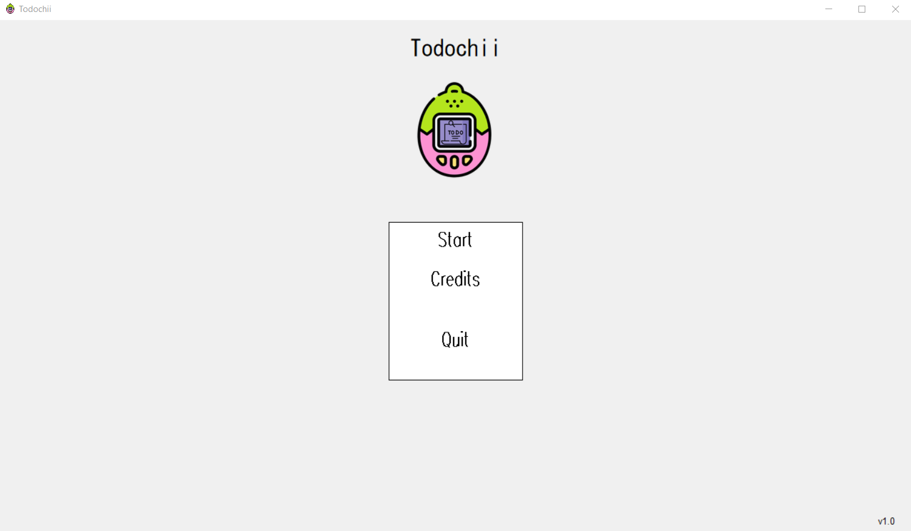
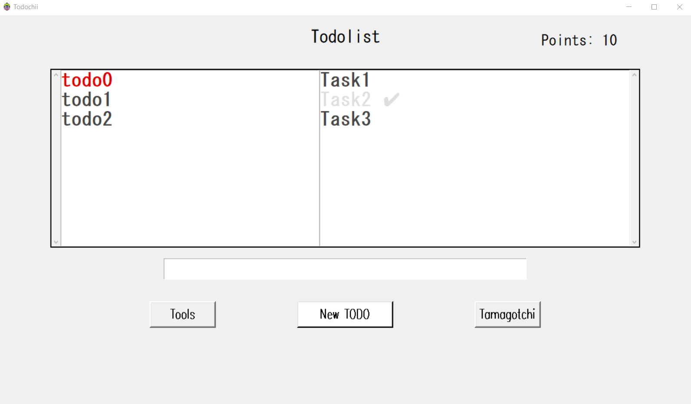
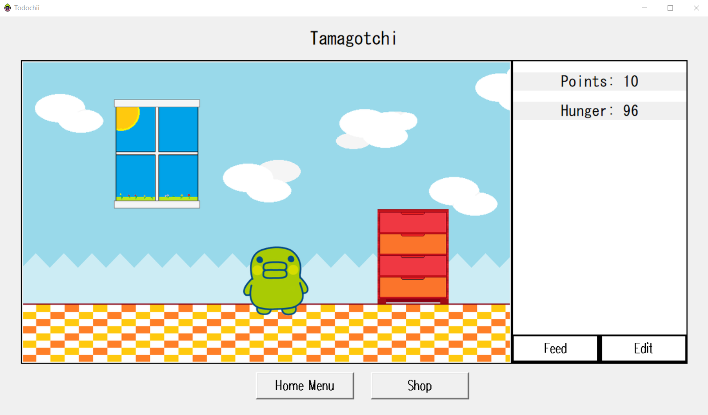
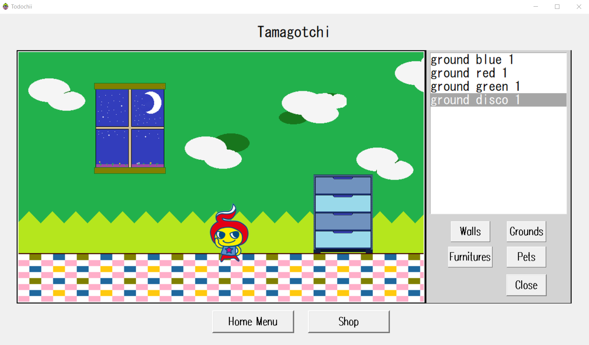
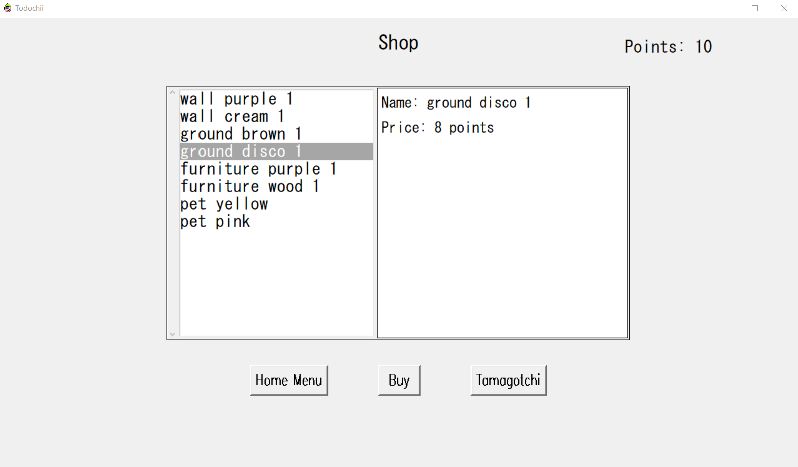

# Todochii

## Description
My first big project that i've done with 3 friends whithin an month and a half, an original concept that combine todolists and tamagotchi, the objective was to motivate the user to realize their intended tasks so they'll rewarded by points that can be spended for feeding their pets

The todolists part is simple but do the job, there aren't any advanced features that you may see in your usual todolist app, the tamagotchi part is simpler than the original concept in the way you only have to care about their hunger and there is not an evolve and death systems, however you can have several pets (only one at the time on the screen and choose which one to display), and also customizable background elements (such as the walls, the floor, a piece of furniture)

All the elements and pets can be bought in the shop for some points (the same used to feed your pet), which is also pretty simple, you have the name of the items and their prices
  

## Content
This Todochii Project directory contains the following files and directories:
### classes directory
Contain all the python classes used in the main class except the main class itself (todochii.py) that is separated from the others for visibility.
### database directory
Contains the data of our app
### ressources directory
Contains all the assets of the app, if you want to replace the current assets by your own images, be sure that they have the same names as the ones you intend to replace.
### demo_images
Only related to Github to show images in the readme of this project so you can have some visuals of the app to see how it looks like
  

## Controls
#### Todolists
- Double-click (on a todolist) : Loads the tasks of the selected todolist
- Double-click (on a todolist) : Marks a task as completed or unmarked it if already completed
- Right-click (on a todolist) : Deletes a todolist
- Right-click (on a task) : Deletes a task
- Enter : Adds the task written in the entry to the loaded todolist
#### Tamagotchi (background editing menu)
- Double-click (on the element) : Applies the background element
#### Shop
- Double click (on a item): Selects an item and displays its information
Once a item is selected, click on the "Buy" button
  

## References
During the developpement of the app, I've faced some problems or simply don't knew how to do some stuff
### How to switch frames, to switch from a page to another on our app
https://stackoverflow.com/questions/7546050/switch-between-two-frames-in-tkinter
### Understanding the parent and controller concept
https://stackoverflow.com/questions/32864610/understanding-parent-and-controllerin-tkinter-init
### pack() function and it’s arguments, used everywhere in the code
https://stackoverflow.com/questions/28089942/difference-between-fill-and-expand- options-for-tkinter-pack-method
### Close a tkinter window, to close the app with a button
https://stackoverflow.com/questions/110923/how-do-i-close-a-tkinter-window
### Bind keys to perform some actions
https://www.geeksforgeeks.org/binding-function-with-double-click-with-tkinter-listbox/
  

## Authors
Realized by Henrique D.M.M (me), Latifa B., Nizar A. and Viktoria I. (my teammates)
  

## Demo images
### Start screen

### Todolist menu, you can see the tasks contained in the todolist "todo0", each completed task gives you 1 point

### Tamagotchi menu, where you can see his hunger and the amount of points earned, you can see the pet and the background elements (all customizable)

### You can customize everything, just give it a try !

### Tto obtain more customizable elements, you can go to the shop to buy some, it'll cost some points

